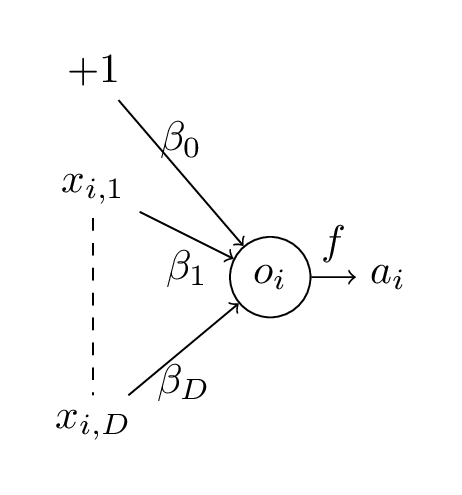
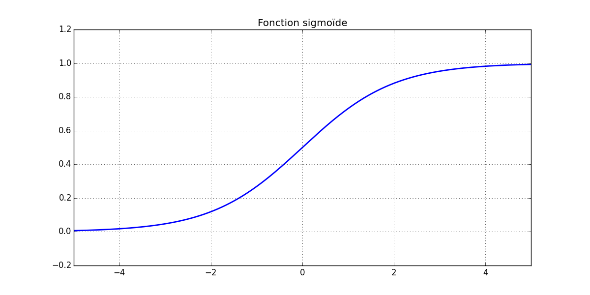
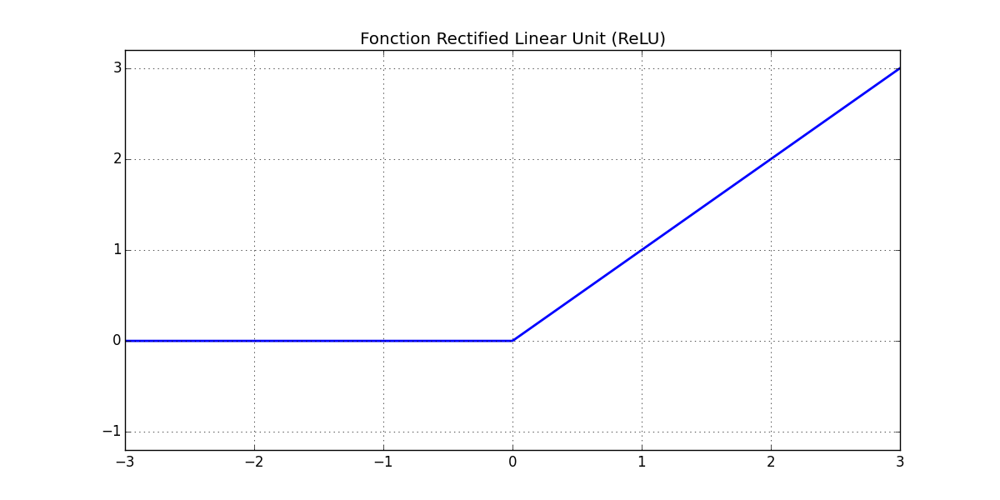

# Régression et perceptron

## Retour sur la régression linéaire

Dans le cas d'une régression aux moindres carrés ordinaires, le modèle est le suivant :

$$y_i = \beta_0 + \sum_j \beta_j x_{i,j} + \epsilon_i,$$

où les $\epsilon_i$ sont i.i.d. gaussiens de moyenne nulle.

On note
$$\hat{y_i} = \beta_0 + \sum_j \beta_j x_{i,j}$$

et l'on souhaite estimer les paramètres $\beta_j$ minimisant la quantité $L(\beta) = \frac{1}{2} \sum_i (y_i - \hat{y_i})^2$.

Vous connaissez probablement une forme explicite permettant d'exprimer les $\beta_j$ en fonction des $y_i$ et des $x_{i,j}$.
Si vous ne connaissiez pas cette forme explicite (ce sera notre cas pour à peu près tous les réseaux de neurones que nous verrons dans la suite), un moyen d'estimer les $\beta_j$ serait de minimiser $L(\beta)$ par descente de gradient.
Pour cela, il nous faudra calculer les dérivées de $L$ par rapport aux différents $\beta_j$ :

$$\frac{\partial{L}}{\partial{\beta_0}} = - \sum_i (y_i - \hat{y_i}) $$ {#eq:grad_lsreg_beta0}
$$\forall j \geq 1, \frac{\partial{L}}{\partial{\beta_j}} = - \sum_i (y_i - \hat{y_i}) x_{i,j}$$ {#eq:grad_lsreg_betaj}

**Travail personnel:** Reprendre les formules précédentes pour le cas d'une régression logistique binaire ($y_i$ peut prendre les valeurs 1 ou -1).

Dans la suite, on aura parfois recours à cet exemple de la régression aux moindres carrés ordinaires pour comprendre comment sont estimés les paramètres des réseaux de neurones.
L'extension à des problèmes de classification (binaire ou non) revient alors à effectuer le même type de modifications que celles présentes dans ce travail personnel (changer l'expression de la vraisemblance, passer à la log-vraisemblance, recalculer les dérivées).

## Le perceptron : notations et représentation

Avant de présenter ce qu'est un réseau de neurones, nous allons nous intéresser à un modèle dans lequel on n'a qu'un neurone : le perceptron.
Dans ce modèle, on suppose :

$$y_i = f\left(\beta_0 + \sum_j \beta_j x_{i,j}\right) + \epsilon_i$$

et on note
$$\begin{array}{rcl}
  o_i & = & \beta_0 + \sum_j \beta_j x_{i,j} \\
  \hat{y_i} = a_i & = & f(o_i) = f\left(\beta_0 + \sum_j \beta_j x_{i,j}\right)
\end{array}
$$

Les paramètres de ce modèle sont les $\beta_j$ et la fonction $f$ est appelée fonction d'activation.

 
Pour cette fonction d'activation, plusieurs choix sont possibles.
On peut citer pour exemples les fonctions sigmoïde et _ReLU_ (Rectified Linear Unit) :

$$\begin{array}{rcl}
  f_1(o_i) & = & \frac{1}{1 + e^{-o_i}} \\
  f_2(o_i) & = & ReLU(o_i) = \begin{cases} o_i, & \text{si } o_i \geq 0\\
                                   0, & \text{sinon}
                     \end{cases}
\end{array}
$$

 
Puisque nous en aurons besoin par la suite, nous pouvons d'ores et déjà calculer la dérivée de ces fonctions :

$$\begin{array}{rcl}
  \frac{\partial{f_1}}{\partial{o_i}} & = & f_1(o_i) \cdot (1 - f_1(o_i)) \\
  \frac{\partial{f_2}}{\partial{o_i}} & = & \begin{cases} 1, & \text{si } o_i > 0\\
                                   0, & \text{si } o_i < 0
                     \end{cases}
\end{array}
$$

Notez que $f_2$ n'est pas dérivable en 0.
On choisit par convention de prolonger sa dérivée en 0 par la valeur 0.
Il faut comprendre ici que ce calcul de dérivée nous servira à effectuer notre descente de gradient.
En pratique, la probabilité que l'on ait à évaluer $\frac{\partial{f_2}}{\partial{o_i}}$ en 0 est nulle.

### Optimisation en pratique

Considérons une fois encore le problème de régression aux moindres carrés ordinaires avec ce modèle.
On cherche donc à minimiser
$$L(\beta) = \frac{1}{2} \sum_i (y_i - \hat{y_i})^2 = \frac{1}{2} \sum_i \underbrace{(y_i - a_i)^2}_{L_i(\beta)}$$
et l'on n'a, cette fois, plus d'expression analytique pour les $\beta_j$ optimaux.
On va donc chercher à effectuer une descente de gradient.

Pour cela, on doit calculer $\frac{\partial{L_i}}{\partial{\beta_j}}$ pour tout $i$ et pour $j = 0 \dots D$ où $D$ est la dimension de l'espace dans lequel vivent nos $x_i$.

Avant toute chose, rappelons la règle de dérivation en chaîne qui nous sera utilie par la suite :

> Si $z=f(y)$ et $y=g(x)$, alors on a :
> $$\frac{\partial{f}}{\partial{x}} = \frac{\partial{f}}{\partial{y}} \cdot \frac{\partial{y}}{\partial{x}}$$

Revenons maintenant à nos $\frac{\partial{L_i}}{\partial{\beta_j}}$.
On sépare le cas $j=0$ et on obtient :

$$\begin{array}{rcl}
  \frac{\partial{L_i}}{\partial{\beta_0}} & = & \frac{\partial{L_i}}{\partial{a_i}} \cdot \frac{\partial{a_i}}{\partial{o_i}} \cdot \frac{\partial{o_i}}{\partial{\beta_0}} \\
  & = & (y_i - a_i) \cdot \frac{\partial{a_i}}{\partial{o_i}} \cdot 1 \\
    \forall j > 0, \, \frac{\partial{L_i}}{\partial{\beta_j}} & = & \frac{\partial{L_i}}{\partial{a_i}} \cdot \frac{\partial{a_i}}{\partial{o_i}} \cdot \frac{\partial{o_i}}{\partial{\beta_j}} \\
    & = & (y_i - a_i) \cdot \frac{\partial{a_i}}{\partial{o_i}} \cdot x_{i,j} \\
 \end{array}
$$

où $\frac{\partial{a_i}}{\partial{o_i}}$ vaut $\frac{\partial{f_1}}{\partial{o_i}}$ ou $\frac{\partial{f_2}}{\partial{o_i}}$ selon la fonction d'activation choisie.
Par exemple, dans le cas de la fonction d'activation sigmoïde, on aura :
$$\frac{\partial{a_i}}{\partial{o_i}} = a_i \cdot (1 - a_i).$$

En pratique, pour effectuer notre descente de gradient, on effectuera les opérations suivantes pour chaque exemple d'apprentissage $(x_i, y_i)$ :

1. Calculer $a_i$ puis l'erreur $\epsilon_i = y_i - a_i$ (passe _forward_) ;
2. Utiliser ces quantités pour calculer les $\frac{\partial{L_i}}{\partial{\beta_j}}$ (rétropropagation, ou _backpropagation_);

Finalement, on calculera $\frac{\partial{L}}{\partial{\beta_j}}$ comme la somme des $\frac{\partial{L_i}}{\partial{\beta_j}}$ et on mettra à jour les $\beta_j$ selon ce qui est indiqué par l'algorithme de descente de gradient choisi.
