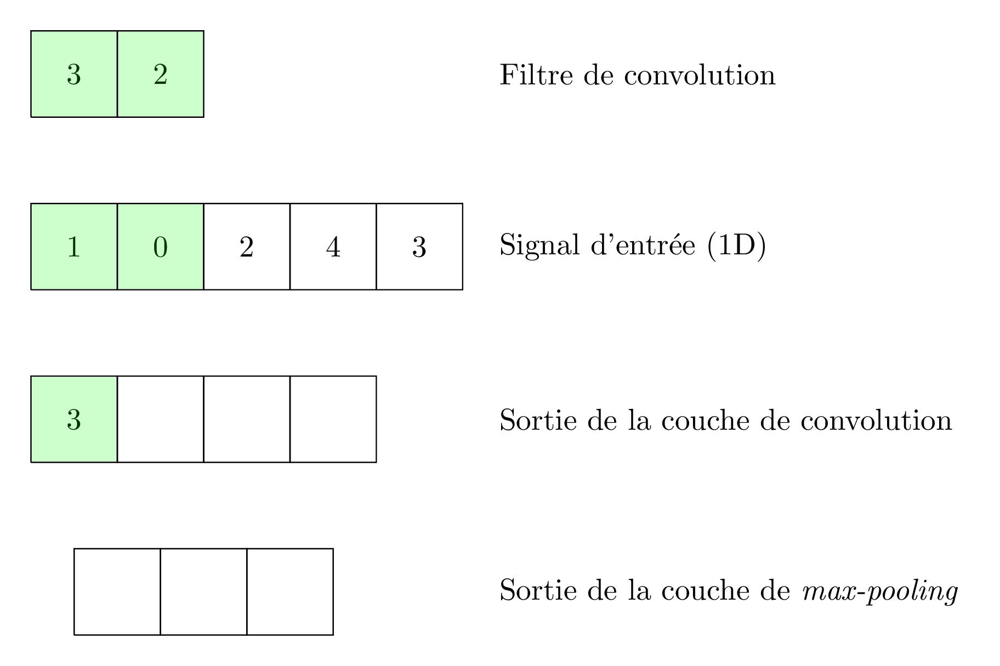
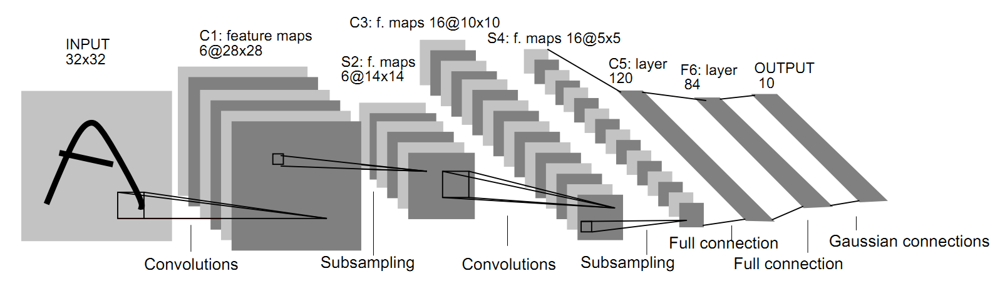

Les réseaux de neurones convolutionnels (_Convolutional Neural Networks_, CNN)
sont des réseaux particuliers qui se basent sur l'opération de convolution.

# Les CNN en bref

Prenons le cas, pour commencer, de la convolution 1D.
Lorsque l'on applique un filtre de convolution $K$ de taille $k$ à un signal
d'entrée $I$, on obtient en sortie un signal $O$ tel que :

$$\forall t, O(t) = \sum_{a=0}^{k-1} I(t+a) K(a)$$

En fait, on devrait plutôt parler ici de _cross-correlation_, mais on utilise
le terme convolution par abus de langage, et cet abus de langage est
généralisé.
On peut d'ores et déjà remarquer que la valeur du signal de sortie sera d'autant
plus grande que le signal d'entrée sera aligné avec le filtre de convolution
(si l'on suppose que les données d'entrée sont standardisées et que les effets
d'échelle sont donc minimes).
Ainsi, l'opération de convolution définie ici peut être vue comme une
détection de la présence d'une sous-partie similaire au filtre de convolution
dans le signal d'entrée.


On a donc ici une structure qui ressemble assez à une couche complètement
connectée (_fully connected_, ou `Dense` selon la terminologie `keras`) d'un
réseau de neurones, sauf que :

* le produit scalaire est calculé entre le filtre de convolution et **une partie
(seulement)** du signal d'entrée ;
* dans la notation présentée plus haut, on n'a pas fait apparaître de fonction
d'activation : en pratique, on en utilisera une, comme pour les couches
complètement connectées.

En pratique, la taille du filtre de convolution utilisé sera petite devant celle
du signal d'entrée, ce qui permettra de limiter le nombre de paramètres à
apprendre pour ces couches convolutionnelles.
De plus, on aura tendance à coupler une couche convolutionnelle (qui permet donc
    de détecter la présence d'un motif) à une couche de _pooling_ qui résume le
résultat des détections sur plusieurs temps consécutifs.
On utilisera surtout le _Max-Pooling_ qui consiste à ne retenir que la valeur
maximale détectée sur un intervalle de temps donné.

L'illustration suivante représente une couche convolutionnelle (avec fonction
    d'activation linéaire pour simplifier les choses) suivie d'une couche de
_max-pooling_.


<br />

## Cas des images

Dans le cas des applications liées aux images (par exemple pour de la
    classification d'images), on utilisera des filtres de convolution 2D :

$$\forall (x, y), O(x, y) = \sum_{a=0}^{k-1}\sum_{b=0}^{k-1} I(x+a, y+b) K(a, b)$$

Il faudra donc fournir, en entrée d'une couche de convolution 2D, une image et
non plus un vecteur.

## Visualisation des filtres appris

Comme expliqué plus haut, une couche convolutionnelle agit comme un détecteur
de formes. Dans le cas des images, il est souvent intéressant de chercher à
visualiser les formes qu'une telle couche peut détecter.
Pour cela, il suffit de visualiser, sous forme d'imagettes, les poids des
filtres de convolution (_c.f._
[[Zeiler and Fergus, ECCV 2014]](https://cs.nyu.edu/~fergus/papers/zeilerECCV2014.pdf)).

On s'aperçoit alors que bien souvent, comme illustré dans la Figure 2 du papier
cité ci-dessus, les filtres des premières couches
convolutionnelles apprennent des formes élémentaires (par exemple des bordures
    obliques) et que, plus on avance dans les couches du réseau, plus les
formes apprises sont complexes (par exemple des visages humains).

## Structure globale d'un réseau convolutionnel

En pratique un réseau de neurones convolutionnel sera bien souvent constitué
d'au moins deux séries de convolution + _pooling_ suivies d'une ou plusieurs
couches complètement connectées.

Dans l'illustration ci-dessous, on voit l'exemple d'un des premiers réseaux
convolutionnels à avoir été développé (par Yann LeCun, aujourd'hui directeur de
_Facebook Artificial Intelligence Research_), appelé LeNet :


<br />

Dans la figure ci-dessus, le terme _Subsampling_ désigne l'opération de
_max-pooling_ et le terme _Gaussian connections_ signifie que la fonction
d'activation utilisée est le _soft-max_.
On peut notamment remarquer qu'à chaque couche de convolution, on n'apprend pas
un mais plusieurs filtres de convolutions (ici 6 filtres à la première couche
    convolutionnelle et 16 filtres à la seconde).

## Réutilisation d'un réseau pré-entrainé

En pratique, lorsque l'on vise une tâche de classification d'image, il est
recommandé de ne pas ré-apprendre un réseau à partir de 0, mais de plutôt partir
d'un réseau pré-appris (notamment par des équipes de recherche disposant de
    machines bien plus puissantes que celles dont vous disposez) et de
n'effectuer qu'une adaptation des dernières couches du réseau.
En effet, comme pour les réseaux complètement connectés, les premières couches
du réseaux doivent être vues comme des couches d'extraction de descriptions
alors que les couches finales sont spécifiques au problème de classification
visé. Ré-utiliser les premières couches revient donc à extraire une
représentation discriminante des images alors que ré-apprendre les dernières
couches du réseau (typiquement les couches complètement connectées) revient à
n'apprendre que le classifieur adapté à son problème.

Pour trouver des modèles à utiliser en `keras`, vous pouvez par exemple jeter
un oeil [ici](https://keras.io/applications/) (ou utiliser
    les mots-clé `"keras model zoo"`).

## En pratique dans keras

Pour utiliser ce type de modèles dans `keras`, il faudra :

* se pencher sur la définition de couches convolutionnelles
[[doc](https://keras.io/layers/convolutional/)] ;
* prendre garde à la dimension des données fournies en entrée au modèle car une
couche convolutionnelle 2D s'attend à recevoir des données de dimension
`(n_x, n_y, c)` où `n_x` est la dimension horizontale de l'image (en nombre de
    pixels), `n_y` est la dimension verticale de l'image et `c` son nombre de
    canaux (si l'image est en niveaux de gris, on aura `c=1`, si elle est en
    RVB, on aura `c=3`) ;
* jeter un oeil aux couches de type
[`Flatten`](https://keras.io/layers/core/#flatten) (à vous de deviner à quel
    moment elles pourraient vous être utiles).

# TD

1. **Sans réutiliser de réseau pré-entrainé**, mettez en oeuvre la structure du réseau LeNet ci-dessus sur le jeu de données MNIST déjà vu en TD (qu'il faudra probablement
retravailler pour que les données soient au bon format pour votre modèle).
Comparez les performances de ce modèle à celles d'un modèle _fully connected_
ayant un nombre équivalent de paramètres.

2. **Cette fois en utilisant un réseau pré-entrainé (par exemple VGG16)**, classifiez le jeu de données d'images contenues dans le répertoire `images/`. Pour cela, vous utiliserez le code suivant pour lire les données :

```python
from keras.preprocessing import image


# TODO: définir votre modèle ici

# Data
batch_size = 64
datagen = image.ImageDataGenerator(validation_split=.2,
                                   preprocessing_function=preprocess_input)
train_generator = datagen.flow_from_directory(
    'images',
    target_size=(150, 150),
    batch_size=batch_size,
    class_mode='categorical',
    shuffle=True,
    subset='training') # set as training data

validation_generator = datagen.flow_from_directory(
    'images', # same directory as training data
    target_size=(150, 150),
    batch_size=batch_size,
    class_mode='categorical',
    subset='validation') # set as validation data

model.fit_generator(generator=train_generator,
                    steps_per_epoch=train_generator.samples // batch_size,
                    epochs=30,
                    validation_data=validation_generator,
                    validation_steps=validation_generator.samples // batch_size)
```

Vous pourrez également vous inspirer de [cet exemple](https://keras.io/applications/#fine-tune-inceptionv3-on-a-new-set-of-classes)
pour comprendre comment ne réapprendre que les couches _fully connected_ d'un
réseau en `keras`.
