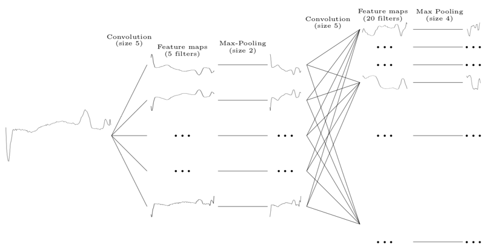

Dans cette séance, nous nous focaliserons sur le cas des données séquentielles.
Pour cela, nous considérerons deux jeux de données synthétiques de séries
temporelles puis nous nous pencherons sur un exemple textuel.

Documentations `keras` utiles pour ce TD :

* [`LSTM`](https://keras.io/layers/recurrent/#lstm)
* [`Conv1D`](https://keras.io/layers/convolutional/#conv1d)
* [`GlobalMaxPooling1D`](https://keras.io/layers/pooling/#globalmaxpooling1d)
* [`fit_generator`](https://keras.io/models/sequential/#fit_generator)

# Jeu de données 1 : présence / absence de motif

Pour cette partie et les deux suivantes, vous partirez du fichier `sequences.py`
disponible sur CURSUS et le compléterez pour répondre à l'énoncé.

1. Générez un jeu fait de 2*100 séries de taille 150 en dimension 1 à l'aide de
la fonction `generator_motif`. Quelles sont les dimensions du tableau
multidimensionnel `X` qui stocke ces données ? Visualisez une série de chaque
classe pour comprendre en quoi elles diffèrent (la différence entre deux séries
d'une même classe est juste due à un bruit blanc). Séparez ces données en jeu
d'apprentissage et jeu de validation.

2. En vous inspirant de la structure représentée dans la figure ci-dessous
à la sortie de laquelle vous brancherez une couche de _Global Max-Pooling_
suivie de 2 couches _fully-connected_, construisez un modèle convolutionnel
de classification qui soit performant pour ces données.

 

3. Comparez ces performances à celles d'un modèle récurrent dans lequel les
deux couches convolutionnelles sont remplacées par des couches `LSTM` contenant
autant de neurones que la version convolutionnelle avait de filtres. Expliquez
les différences observées.

# Jeu de données 2 : décalage de phase

4. Répétez les expériences précédentes avec les données générées par la fonction
`generator_sin`. Encore une fois, expliquez les différences observées.

# Prédiction de valeurs futures avec un modèle récurrent

Jusqu'à présent, vous avez, la plupart du temps, appris vos modèles en `keras`
à l'aide de la méthode `fit` à laquelle on passe un jeu de données fixe et qui
s'occupe de le découper en _batchs_. Vous avez également vu (lors du TD sur la
classification d'images) qu'il était possible d'utiliser  la méthode
`fit_generator` pour ne pas avoir à charger explicitement les données dans des
matrices `X` et `y`. Cette méthode est en fait utile à partir du moment où l'on
ne souhaite pas avoir un jeu d'apprentissage uniforme, ce qui inclut les cas
suivants (attention, cette liste n'est pas exhaustive) :

* données passées par une étape de _data augmentation_ (que ce soit des images
ou pas) ;
* séquences de taille variable pour un modèle récurrent.

Dans cette partie, nous nous focaliserons sur ce second cas.
Un argument important de cette méthode `fit_generator` est le `generator` qui
doit être une fonction qui génère (instruction `yield` en Python), infiniment,
des nouveaux _batchs_ sous la forme de couples `X_batch`, `y_batch`.

5. En utilisant une variante du modèle récurrent précédent, proposez un modèle
de prédiction qui puisse prendre en entrée un nombre arbitraire d'observations
pour une série temporelle et prédise la prochaine valeur. Pour cela, vous
pourrez utiliser le générateur de données fourni dans votre script, qui est
compatible avec la fonction `fit_generator` des modèles `keras`.

# Génération de texte avec un modèle récurrent

Pour cette partie, vous partirez du fichier `textgen.py`
disponible sur CURSUS et l'adapterez pour répondre à l'énoncé.

6. Quelle est la structure (nombre et nature des couches, nombre de neurones par
couche, _etc._) du modèle codé dans cet exemple ?

7. Combien d'itérations sont effectuées dans ce code ? Quelle est la "mémoire"
maximale que peut capturer ce modèle ? Quelle quantité de données (nombre de
séquences) est fournie pour apprendre ce modèle ? Par rapport aux préconisations
indiquées dans l'en-tête de ce fichier, à quoi pouvez-vous vous attendre ?

8. Exécutez ce code et observez le temps de calcul ainsi que la qualité de
prédiction (à la fois en termes quantitatifs et qualitatifs). Qu'en
pensez-vous ?

9. Tentez de modifier le modèle en rajoutant une couche LSTM et observez
l'impact de cette modification.

10. Même question en passant à un modèle convolutionnel 1D.
