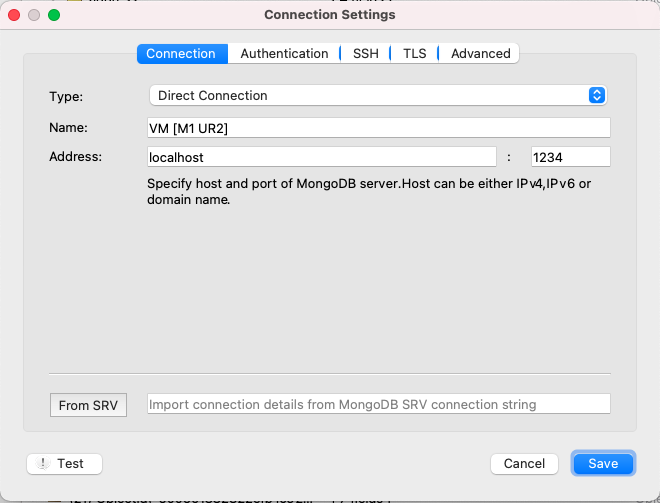
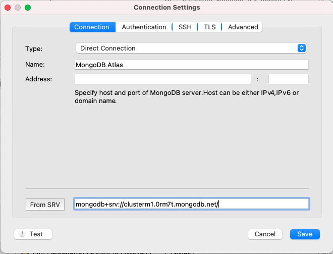
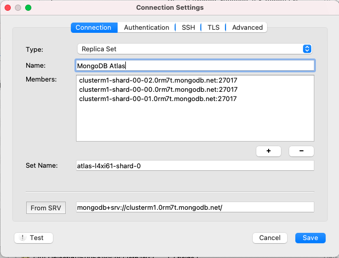
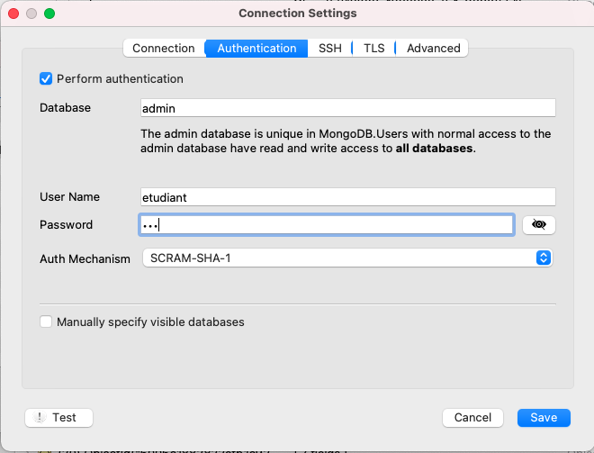
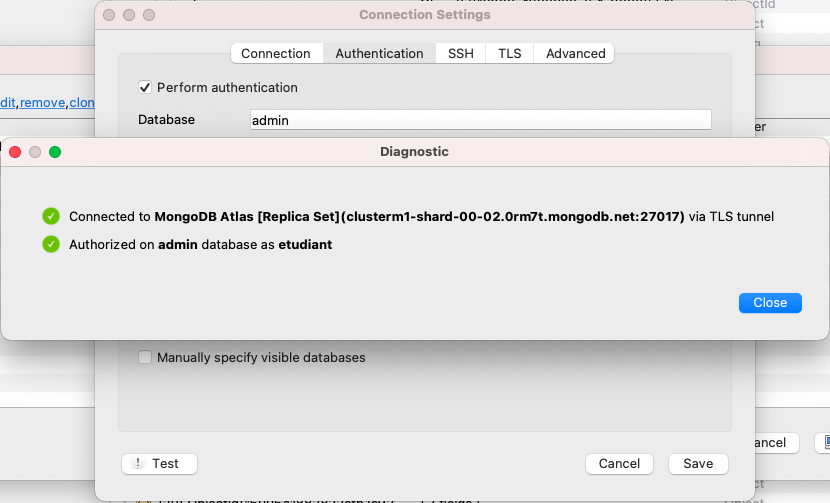

# Étape 1 : installation du serveur `mongoDB`

Pour installer ce serveur, nous allons utiliser une machine virtuelle, qui
tournera grâce au logiciel virtualbox.
Si vous ne disposez pas déjà de ce logiciel, vous pouvez l'installer en suivant
les instructions à cette adresse : <https://www.virtualbox.org/wiki/Downloads>.

Ensuite, téléchargez l'image préparée pour ce cours[^lien_vm].
Démarrez VirtualBox, puis sélectionnez
"Fichier -> Importer un appareil virtuel".
Cela devrait ajouter une machine virtuelle nommée "VM_MongoDB" dans la liste de
VirtualBox.

[^lien_vm]: <https://filesender.renater.fr/?s=download&token=af3af415-c274-45ad-8a08-ac1d5ab42e01>

Dans VirtualBox, sélectionnez cette machine et cliquez sur "Démarrer"
(flèche verte).
Une fois la machine correctement démarrée, vous devriez voir un message
d'accueil indiquant qu'il s'agit bien de la machine virtuelle qui vous servira
de serveur MongoDB pour ce cours. Conservez la fenêtre de cette machine
virtuelle (éventuellement en arrière-plan).

# Étape 2 : installation d'un client avec interface graphique

Il existe plusieurs clients MongoDB. Pour ce cours, je vous propose d'utiliser
un client appelé Robo 3T. Vous pourrez le télécharger à cette adresse :
<https://robomongo.org/download> (sélectionnez "Download Robo 3T only").

Une fois téléchargé et installé, si vous le lancez, il vous proposera de créer
de nouvelles connexions à des bases de données.

## Alternative 1 : votre serveur tourne sur la machine virtuelle créée à l'étape 1

Ajoutez une nouvelle connexion, puis renseignez les informations suivantes :

> Address : localhost (puis, après les ":") 1234



Enfin, cliquez sur "Connect".
Si tout se passe bien, vous devriez voir, dans votre fenêtre Robo 3T plusieurs
bases auxquelles vous connecter : c'est que tout fonctionne.

## Alternative 2 : vous utilisez MongoDB Atlas
(voir la section "Si votre ordinateur ne supporte pas la virtualisation" plus
bas)

Ajoutez une nouvelle connexion, puis, sur la ligne "From SRV", entrez l'URL
suivante :

```
mongodb+srv://clusterm1.0rm7t.mongodb.net/
```



Cliquez ensuite sur le bouton "From SRV", qui devrait compléter les
informations de connexion au serveur comme suit (seul le nom du serveur a été
indiqué à la main ici, cette information n'est de toute façon pas cruciale) :



Allez ensuite dans l'onglet "Authentication" et saisissez :

* `username` : `etudiant`
* `password` : `ur2`



Pour vérifier que tout fonctionne, cliquez sur le bouton "Test" en bas à gauche
et vous devriez obtenir quelque chose comme :



Enfin, cliquez sur "Connect".
Si tout se passe bien, vous devriez voir, dans votre fenêtre Robo 3T plusieurs
bases auxquelles vous connecter : c'est que tout fonctionne.

# Pour utiliser MongoDB durant le semestre

Si cette installation s'est bien passée, pour utiliser MongoDB durant le
semestre, vous n'aurez qu'à redémarrer la machine virtuelle dans VirtualBox
(d'une part) et le client Robo 3T en lui demandant de se connecter à la même
adresse que précédemment (d'autre part).

# Si votre ordinateur ne supporte pas la virtualisation

Il semble que sur certaines machines, la virtualisation ne puisse pas
fonctionner.
Dans ce cas, deux solutions s'offrent à vous :

1. la plus simple sera d'utiliser, pendant les TD, une connexion à une instance
MongoDB Atlas pour laquelle les informations de connexion vous sont fournies à
l'étape 2 :
les bases de données auxquelles vous vous connecterez seront
alors hébergées en ligne et vous n'aurez pas de droit de modification sur ces
bases.
2. une autre option consiste à installer (puis lancer) un
serveur MongoDB
sur votre machine en suivant les instructions fournies à l'adresse :
<https://docs.mongodb.com/manual/administration/install-community/>

Dans ces deux cas, la solution proposée est à effectuer en lieu et place de
l'étape 1 ci-dessus. La connexion à la base de données depuis le client Robo 3T
(et donc l'installation de ce client)
reste nécessaire quelle que soit l'option retenue.
