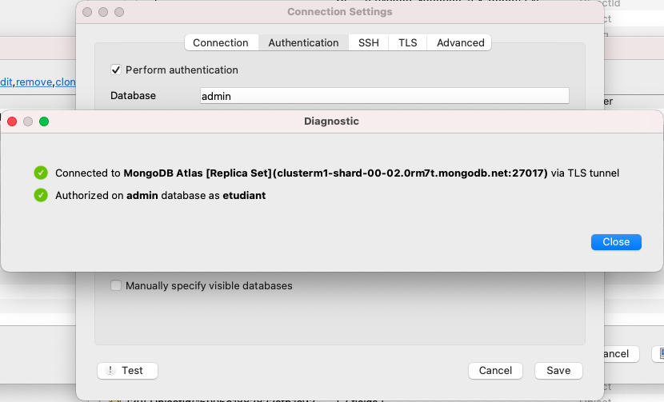

# Installation d'un client avec interface graphique

Il existe plusieurs clients MongoDB. Pour ce cours, je vous propose d'utiliser
un client appelé Studio 3T Free. Vous pourrez le télécharger à cette adresse :
<https://studio3t.com/download-studio3t-free> (sélectionnez "Download Studio 3T Free").

Une fois téléchargé et installé, si vous le lancez, il vous proposera de créer
de nouvelles connexions à des bases de données.

Ajoutez une nouvelle connexion, puis, sur la ligne "From SRV", entrez l'URL
suivante :

```
mongodb+srv://clusterm1.0rm7t.mongodb.net/
```


Cliquez ensuite sur le bouton "From SRV", qui devrait compléter les
informations de connexion au serveur comme suit (seul le nom du serveur a été
indiqué à la main ici, cette information n'est de toute façon pas cruciale) :


Allez ensuite dans l'onglet "Authentication" et saisissez :

* `username` : `etudiant`
* `password` : `ur2`


Pour vérifier que tout fonctionne, cliquez sur le bouton "Test" en bas à gauche
et vous devriez obtenir quelque chose comme :



Enfin, cliquez sur "Connect".
Si tout se passe bien, vous devriez voir, dans votre fenêtre Robo 3T plusieurs
bases auxquelles vous connecter : c'est que tout fonctionne.

# Pour utiliser MongoDB durant le semestre

Si cette installation s'est bien passée, pour utiliser MongoDB durant le
semestre, vous n'aurez qu'à redémarrer le client Robo 3T en lui demandant de se
connecter à la même
adresse que précédemment.
