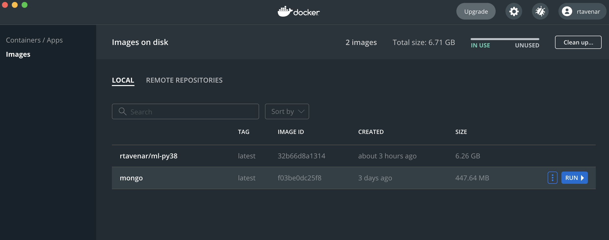
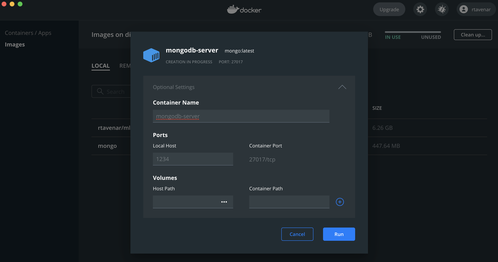

# Préambule

Cette séance est un peu particulière.
En effet, il va s'agir, pour vous, de vous essayer à la modification du contenu d'une base.
Vous ne pourrez donc pas continuer, comme c'était le cas jusqu'alors, à tous travailler en même temps sur une base hébergée par MongoDB Atlas.
Pour simuler le fonctionnement d'un serveur MongoDB tournant sur votre machine, nous allons utiliser Docker.

Voici la liste des étapes à suivre pour lancer votre serveur MongoDB :

1. Téléchargez et installez [Docker Desktop](https://docs.docker.com/get-docker/) (ou Docker Engine si vous êtes sous linux) ; **attention : cette étape risque de prendre beaucoup de temps, notamment si votre connexion internet est lente** ;
2. Lancez Docker Desktop, créez un compte sur `hub.docker.com` et saisissez vos identifiants pour ce compte dans Docker Desktop (j'imagine, sans en être sûr, que cette étape est sensiblement similaire pour les utilisateurs de linux, en utilisant Docker Engine) ;
3. Dans un terminal (ou une "invite de commande" si vous êtes sous Windows), entrez la commande suivante : `docker pull mongo` ; cela va importer l'image (sorte de machine virtuelle) nommée `mongo` sur votre machine, et celle-ci devrait donc apparaître dans l'onglet "Images", dans Docker Desktop ;
4. Dans ce même onglet "Images", cliquez sur "Run" en face de cette image pour créer un conteneur dérivé de cette image et, dans les paramètres optionnels (_Optional Settings_), choisissez de rediriger le port 27017 du conteneur vers le port 1234 de votre machine, comme indiqué sur ces captures d'écran :


Cette étape 4. peut être réalisée sans passer par l'interface graphique de Docker Desktop en lançant dans un terminal la commande : `docker run --publish 1234:27017 mongo` : lorsque vous exécutez cette commande, vous lancez votre serveur dans le terminal, et vous devrez donc prendre garde à ne pas fermer cette fenêtre de terminal avant la fin du TD ;
5. Créez dans Robo3T une connexion vers `localhost` sur le port `1234` et vérifiez que cette connexion se fait sans encombre.

# Création de la base

1. Créez une nouvelle base `voitures` dans laquelle une collection `ventes` servira à tenir le compte des voitures à la vente dans un garage.

2. Insérez dans cette base les documents suivants :

```
{"modèle" : "C1", "quantité" : 15, "date_maj": new Date()}
{"modèle" : "Mégane", "quantité" : 2, "date_maj": new Date()}
{"modèle" : "C3", "quantité" : 15, "date_maj": new Date()}
{"modèle" : "Twingo", "quantité" : 2, "date_maj": new Date()}
{"modèle" : "Fiat 500", "quantité" : 0, "date_maj": new Date()}
```

# Mise à jour des données

3. Sachant que la plupart des recherches dans cette collection se feront par nom de modèle, mettez en place un index adapté.

4. Modifiez le document correspondant au modèle `"Mégane"`{.haskell} pour que le nom de modèle soit `"Mégane III"`{.haskell}, la `quantité` `5` et la nouvelle `"date_maj"`{.haskell} soit la date courante.

5. Pour chaque modèle, ajoutez un attribut correspondant à la marque (Renault pour Mégane par exemple). Pour le cas de la Fiat 500, on se rend compte qu'alors il faudra modifier le nom du modèle pour qu'il ne contienne plus le nom de la marque.

6. Ajoutez un attribut contenant le pays d'origine des voitures (France pour les voitures Renault et Citroën, Italie pour les Fiat). Prenez garde au fait qu'il peut exister plusieurs modèles pour une même marque.

7. Suite à une vente, il faut décrémenter le compteur du nombre de C1 à la vente (et mettre à jour la `date_maj`). Proposez une requête pour le faire en utilisant [l'opérateur `$inc`](https://docs.mongodb.org/v3.0/reference/operator/update/inc/#up._S_inc)

8. Proposez une nouvelle requête pour s'assurer que le document correspondant au modèle Xsara, s'il existe, contienne bien pour marque Citroën. Si ce document n'existe pas, créer un document avec une `quantité` de `0` et une `date_maj` égale à la date courante. <https://docs.mongodb.org/v3.0/reference/operator/update/setOnInsert/>

# Suppression de la base

9. Supprimez l'ensemble des données de la collection, mais pas ses index. Vérifiez la présence des index après cette opération.

10. Supprimez maintenant la collection en entier et voyez l'effet produit sur la liste des index de la base.

11. Pour finir, supprimez la base entière.
