Pour pouvoir utiliser l'API Tweepy et récupérer des données sur Twitter, vous devez :

1. disposer d'un compte Twitter (si ce n'est pas le cas, créez-en un);
2. valider un "profil développeur" dans l'interface <http://apps.twitter.com>
3. créer une "Application" dans l'interface <http://apps.twitter.com>

Ce tutoriel vous aide sur les étapes 2. et 3.

# Le "profil développeur"

Dans un premier temps, lorsque vous vous connectez avec votre compte Twitter et que vous vous rendez à l'URL : <http://apps.twitter.com>, vous devez voir un bandeau tel que celui-ci :

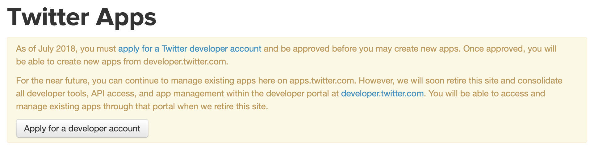
<br />

Si vous cliquez sur le bouton "Apply for developer account", vous arrivez ensuite sur une page du type :

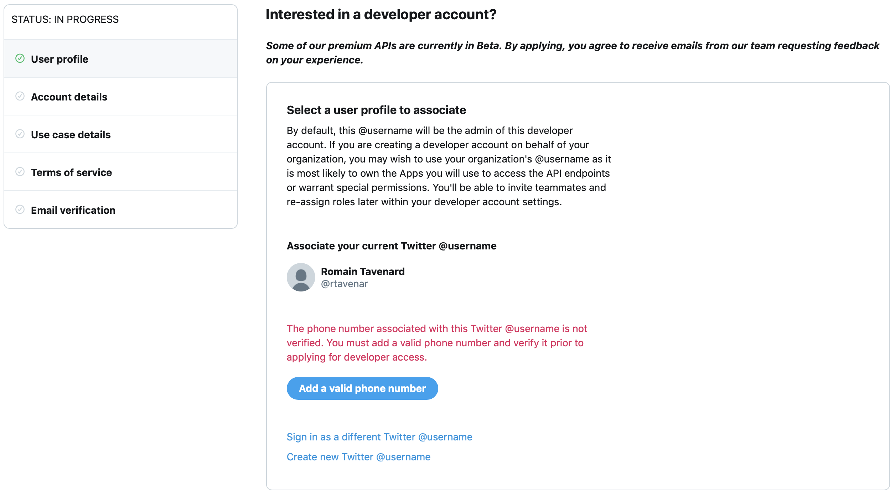
<br />

Si, comme c'est le cas ici, vous n'avez pas spécifié de numéro de téléphone lors de la création de votre compte Twitter, il vous est demandé d'en renseigner un pour poursuivre (celui-ci pourra ensuite être supprimé de vos informations personnelles via l'interface de gestion de votre compte Twitter) :

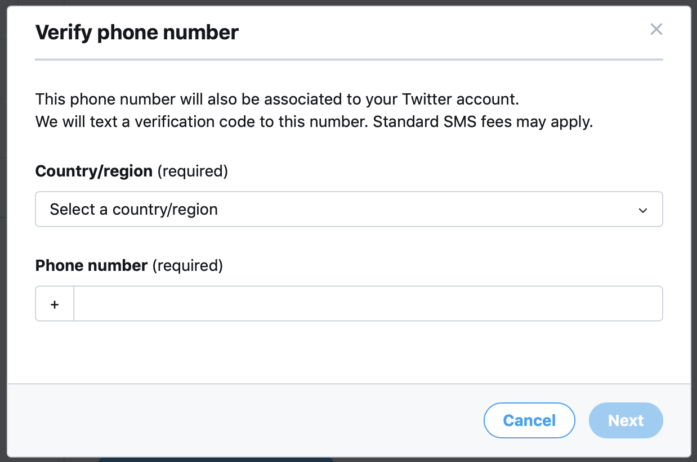
<br />

Une fois votre numéro de téléphone et le code de validation saisis, vous arrivez sur une page vous demandant un certain nombre d'informations. Vous pouvez la remplir comme suit (typiquement en utilisant votre nom d'utilisateur à la place de `rtavenar`) :

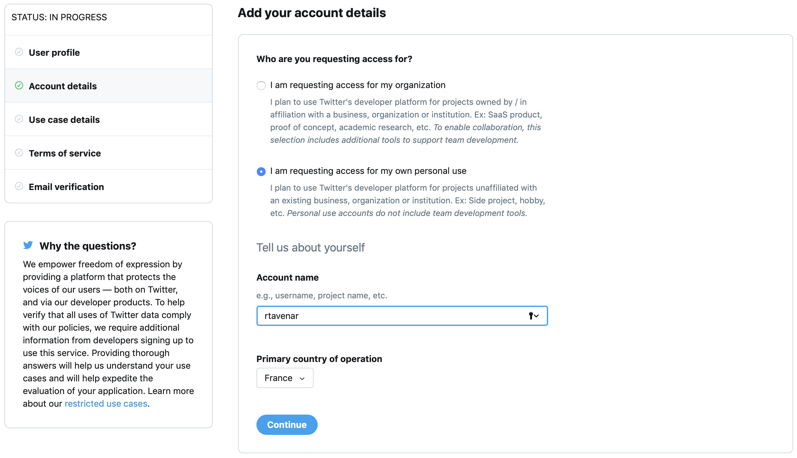
<br />

Si vous validez, vous tombez sur une autre page vous demandant des renseignements, que nous vous recommandons de remplir comme suit :

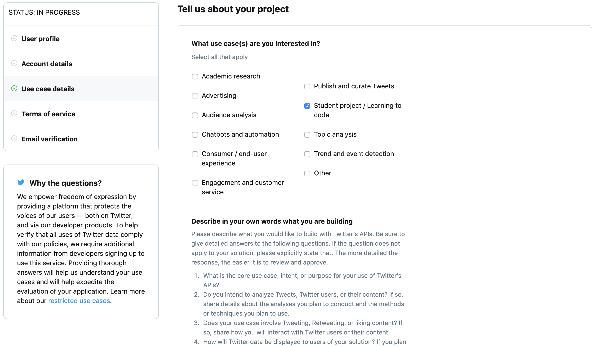
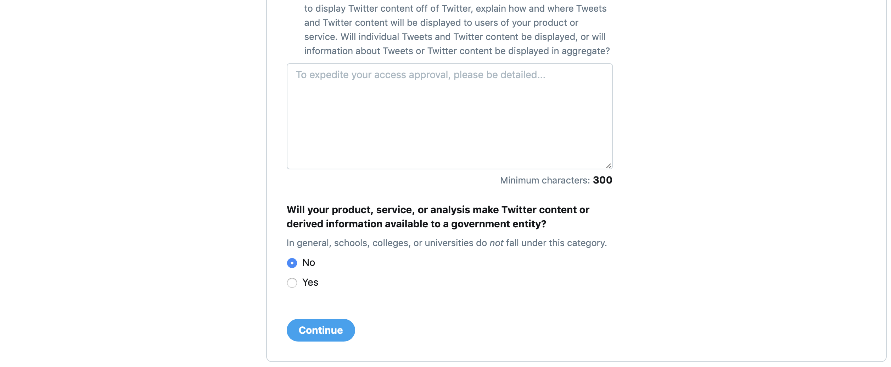
<br />

Concernant le texte de 300 caractères que vous devez renseigner, nous vous proposons ce texte :

```
1. I will use Tweeter API jointly with the tweepy Python module in a course at the bachelor level. The goal is to learn how to use APIs in Python programs.
2. I have no plan to analyze tweets in any way, I will just play with the tweepy module to understand what it allows.
3. I will not tweet, retweet or like content except for demo purposes.
4. There is no end-user solution planned so point number 4. is irrelevant for my use.
```

Vous arrivez alors sur la page de validation des termes de service, que vous prendrez soin de lire. En voici un extrait :

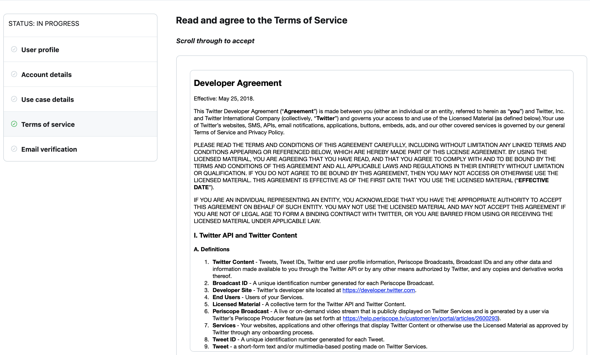
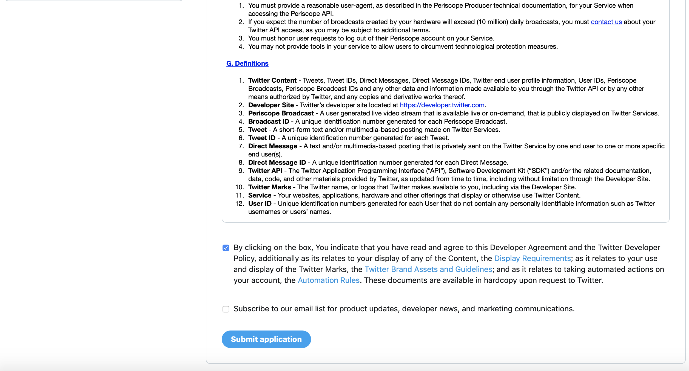
<br />

Si vous cliquez finalement sur "Submit Application", vous touchez au but. Vous devrez peut–être valider votre adresse e-mail et vous arriverez alors sur cette page :

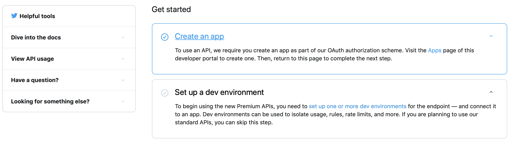
<br />

En cliquant sur "Create an App", vous arrivez au point 3. listé dans l'introduction de ce document.

# Créer une Application

Vous devez alors arriver sur une interface du type :

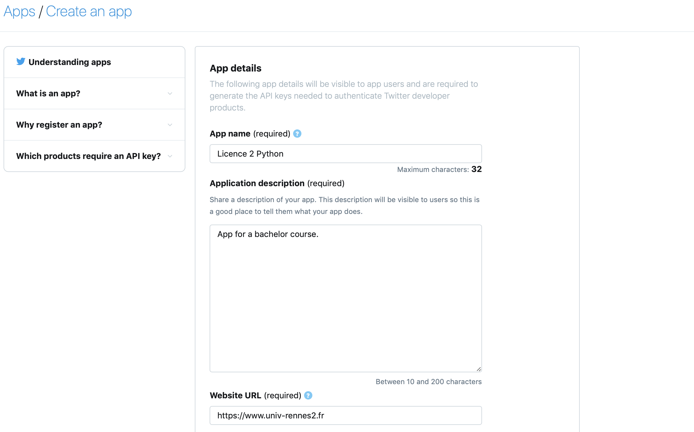
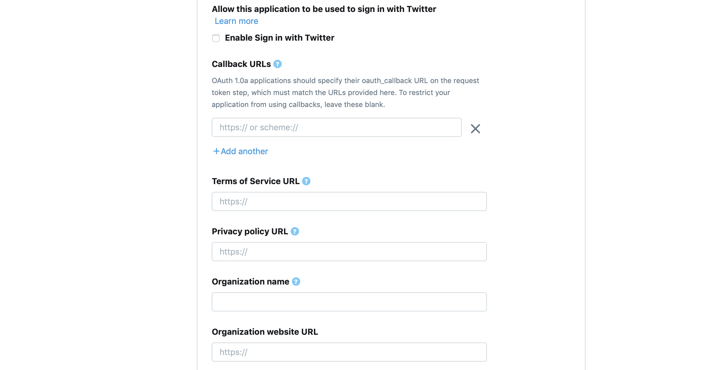
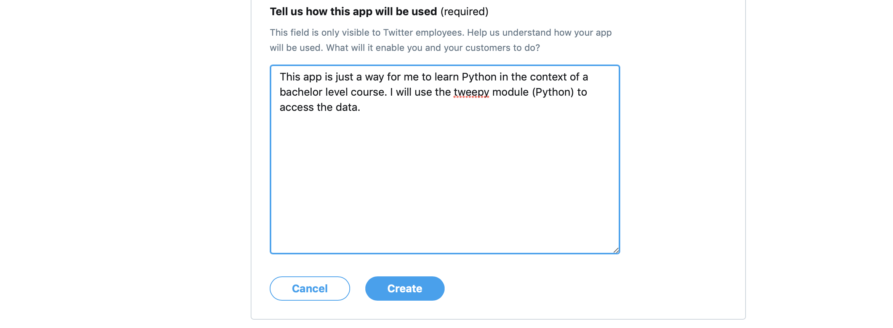
<br />

Le texte rempli en bas est le suivant :

```
This app is just a way for me to learn Python in the context of a bachelor level course. I will use the tweepy module (Python) to access the data.
```

Appuyez ensuite deux fois de suite sur "Create" et vous arrivez sur une interface du type :

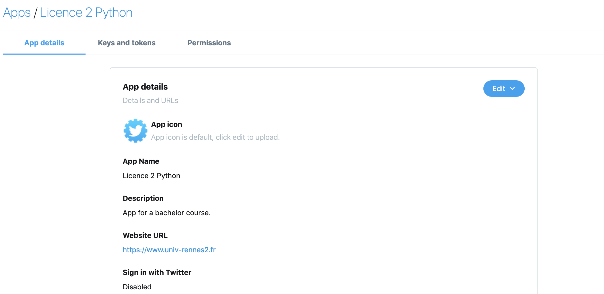
<br />

Cliquez alors sur l'onglet "Keys and Tokens" et vous devriez voir une page du type :

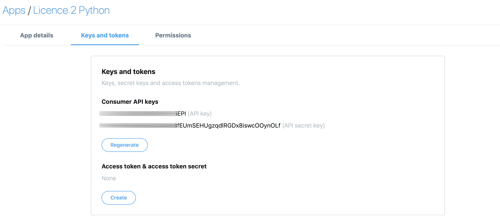
<br />

Il ne vous reste plus qu'à cliquer sur "Create" dans la section "Access token & access token secret" et tous vos identifiants sont prêts pour passer à la suite : l'utilisation du module Tweepy !
Ce sont ces identifiants que vous devrez stocker dans un fichier que vous lirez pour vous authentifier à chaque fois que vous utiliserez Tweepy.
