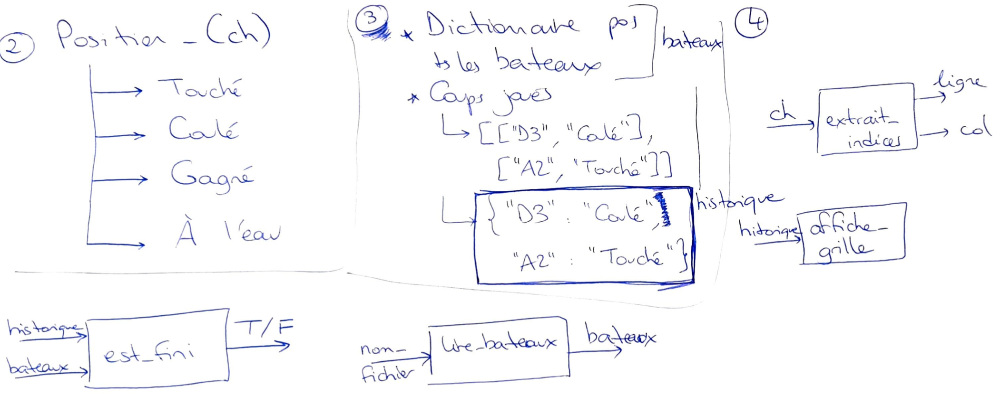

---
title : Bataille navale
subtitle: Planche de TD pour un cours dispensé à l'université de Rennes 2
language: fr
author: Aurélie Lemaitre, Romain Tavenard
rights: Creative Commons CC BY-NC-SA
---
# Travail effectué en CM

1. Vérifier que vous connaissez les règles du jeu de bataille navale ([lien](https://fr.wikipedia.org/wiki/Bataille_navale_(jeu))).

2. En lisant soigneuseument les traces d'exécution ci-dessous, répondez aux questions suivantes :
* Que joue le joueur ?
* Quelles sont les différentes réponses possibles du système ?

3. Réfléchir aux structures de données à utiliser pour mémoriser la position des bateaux ainsi que les différents coups du joueur.

4. Réfléchir à une méthode permettant de traduire les coordonnées sous forme lettre/chiffre vers un numéro de ligne et de colonne.
Exemple : `"B2"`{.haskell} donne "2ème ligne, 2ème colonne".

# Fruit des réflexions de CM

&nbsp;


# Énoncé

5. Programmez (en Python) un jeu de bataille navale pour lequel la position des navires sera lue dans un fichier annexe dont voici un exemple contenant 2 navires nommés respectivement `1` et `2` :
```
1,D1,D2,D3
2,E4,F4
```
Le programme demandera au joueur de rentrer une case dans laquelle jouer jusqu'à ce qu'il ait coulé tous les bateaux.
Votre programme devra fournir une sortie du type :
```
Entrez une position pour jouer A1
À l'eau
   ABCDEFGHIJ
01:X         
02:          
03:          
04:          
05:          
06:          
07:          
08:          
09:          
10:          
Entrez une position pour jouer C2
À l'eau
   ABCDEFGHIJ
01:X         
02:  X       
03:          
04:          
05:          
06:          
07:          
08:          
09:          
10:          
Entrez une position pour jouer C4
À l'eau
   ABCDEFGHIJ
01:X         
02:  X       
03:          
04:  X       
05:          
06:          
07:          
08:          
09:          
10:          
Entrez une position pour jouer D4
À l'eau
   ABCDEFGHIJ
01:X         
02:  X       
03:          
04:  XX      
05:          
06:          
07:          
08:          
09:          
10:          
Entrez une position pour jouer F4
Touché
   ABCDEFGHIJ
01:X         
02:  X       
03:          
04:  XX O    
05:          
06:          
07:          
08:          
09:          
10:          
Entrez une position pour jouer E4
Bateau 2 coulé
   ABCDEFGHIJ
01:X         
02:  X       
03:          
04:  XXOO    
05:          
06:          
07:          
08:          
09:          
10:          
Entrez une position pour jouer D1
Touché
   ABCDEFGHIJ
01:X  O      
02:  X       
03:          
04:  XXOO    
05:          
06:          
07:          
08:          
09:          
10:          
Entrez une position pour jouer D2
Touché
   ABCDEFGHIJ
01:X  O      
02:  XO      
03:          
04:  XXOO    
05:          
06:          
07:          
08:          
09:          
10:          
Entrez une position pour jouer D3
Bateau 1 coulé
   ABCDEFGHIJ
01:X  O      
02:  XO      
03:   O      
04:  XXOO    
05:          
06:          
07:          
08:          
09:          
10:          
Partie gagnée en 9 tours
```
