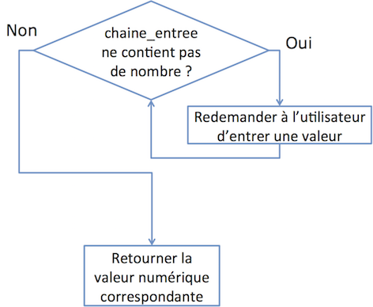

Le but de cette planche de TD est de vous permettre de vous entrainer par vous-même et de confronter vos solutions avec celles d'un corrigé type (qui n'est pas forcément la seule façon de faire).
Ainsi, pour que ces exercices vous soient les plus bénéfiques possibles, il est nécessaire que vous jouiez le jeu et ne cherchiez pas à regarder le corrigé avant de proposer votre propre solution.
Si certains éléments de correction ne vous semblent pas évidents ou si vous souhaitez savoir si votre solution était une alternative correcte à celle proposée dans le corrigé, n'hésitez pas à poser la question à votre enseignant de TD.

Pour chacune des questions qui suivront, il vous est demandé de vous poser les questions suivantes :

* Quel est l'objectif de la fonction et quel nom peut-on lui donner ?
* Que prend en entrée la fonction que vous allez coder ?
* Est-ce qu'elle renvoie une valeur ou affiche un résultat ?
* Que fait-elle (répétition d'action, séquence, etc) ?
* Comment sera-t-elle appelée et quels appels devez-vous faire pour tester son bon fonctionnement (vous veillerez notamment à vous assurer que tous les cas de figure possible ou presque ont été testés) ?

Pour réaliser cette planche de TD, vous pourrez avoir besoin des fonctions suivantes :

* `print()` : <https://docs.python.org/3/library/functions.html#print>
* `input()` : <https://docs.python.org/3/library/functions.html#input>
* `isnumeric()` : <https://docs.python.org/3/library/stdtypes.html#str.isnumeric>
* `int()` : <https://docs.python.org/3/library/functions.html#int>
* `float()` : <https://docs.python.org/3/library/functions.html#float>
* `math.sqrt()` : <https://docs.python.org/3/library/math.html#math.sqrt>
* `len()` : <https://docs.python.org/3/library/functions.html#len>
* `sorted()` : <https://docs.python.org/3/library/functions.html#sorted>

1. Écrivez une fonction qui prenne en entrée deux valeurs et affiche dans cet ordre la plus petite puis la plus grande.

> **Correction.** La fonction que l'on souhaite coder ici prend en entrée deux valeurs, on peut donc commencer par écrire son en-tête :
```python
def affiche_valeurs(a, b):
```
> Cette fonction ne renvoie aucune valeur (elle ne fait qu'afficher les valeurs fournies en paramètre dans un ordre donné) : elle ne devra donc pas contenir d'instruction `return`{.python}.
> Enfin, la fonction doit afficher `a` puis `b` si `a` est plus petit que `b` et `b` puis `a` sinon, on utilise pour cela la fonction `print` :
```python
def affiche_valeurs(a, b):
    if a < b:
        print(a, b)
    else:
        print(b, a)
```
> Pour s'assurer que cette fonction se comporte comme on l'attend, il convient de l'appeler en testant les différents cas de figure possibles (`a < b`{.python}, `a = b`{.python}, `a > b`{.python}) :
```python
affiche_valeurs(1, 2)
affiche_valeurs(2, 1)
affiche_valeurs(1, 1)
```

2. Écrivez une fonction qui demande un nombre à l'utilisateur tant que la valeur entrée n'en est pas un et retourne le nombre entré.
Vous offrirez la possibilité de spécifier lors de l'appel de la fonction le texte à afficher pour demander un nombre.
Sinon, le texte par défaut sera `"Entrez un nombre"`{.haskell}.

> **Correction.** La fonction que l'on souhaite coder ici prend en entrée une chaîne de caractères qui sera celle à afficher sur le terminal pour demander à l'utilisateur de rentrer une valeur.
> Cet argument est facultatif et il faudra donc lui donner une valeur par défaut.
> Cette fonction devra retourner une valeur : la valeur numérique finalement entrée.
```python
def entre_valeur(s="Entrez un nombre "):
    # [...]
    return valeur
```
> Le cœur de cette fonction correspond à une répétition d'actions : tant que l'utilisateur entre une valeur qui n'est pas numérique (il faudra faire attention ici à la négation !), il faut lui redemander d'en entrer une autre (en utilisant la chaîne `s`{.python}) :



> On utilisera donc une boucle `while`{.python}.
> Pour demander à un utilisateur d'entrer une valeur, on utilise la fonction `input`{.python}, à laquelle on passe la variable `s`{.python} à afficher pour demander d'entrer un nombre) :
```python
chaine_entree = input(s)
```
> De plus, pour tester si une chaîne de caractère contient une valeur numérique, en Python, on utilise la méthode `isnumeric`{.python} qui renvoie `True`{.python} si la chaîne en question contient une valeur numérique et `False`{.python} sinon. On en arrive ainsi au morceau de code suivant :
```python
while not(chaine_entree.isnumeric()):
    chaine_entree = input(s)
```
> Seulement, la première fois qu'on entrera dans cette boucle, la variable `chaine_entree`{.python} ne sera pas définie, et Python renverra donc une erreur.
> Pour y remédier, il faut donc initialiser cette variable avant d'entrer dans la boucle, ce qui donne :
```python
chaine_entree = ""
while not(chaine_entree.isnumeric()):
    chaine_entree = input(s)
```
> Une fois sortis de la boucle `while`{.python}, on sait que la variable `chaine_entree`{.python} contient une chaîne de caractères correspondant à une valeur numérique.
> Il reste alors à transformer cette chaîne en nombre à virgule à l'aide de la fonction `float()`{.python} et à retourner cette valeur :
```python
def entre_valeur(s="Entrez un nombre "):
    chaine_entree = ""
    while not(chaine_entree.isnumeric()):
        chaine_entree = input(s)
    valeur = float(chaine_entree)
    return valeur
```

3. Écrivez une fonction qui calcule le $n$-ième terme (où $n$ est fourni en argument de la fonction) de la suite récursive définie par :
$$\begin{array}{cccc} & u_0 & = & 0 \\
\forall n \geq 0, \, & u_{n+1} & = & 7 u_n + (n + 1)^5\\
\end{array}$$

> **Correction.** La fonction à coder ici prend en entrée un entier $n$ (le rang) et retourne un entier égal à $u_n$.
```python
def u(n):
    # [...]
    return valeur
```
> Comme l'indique la définition récursive de la suite, on a deux cas à considérer : si `n`{.python} vaut 0 d'une part et si `n`{.python} est au moins égal à 1 d'autre part.
> Dans le premier cas, il suffira de stocker 0 dans la variable `valeur`{.python}.
> Le deuxième cas est un peu plus délicat puisqu'il nécessite un appel récursif à la fonction `u`{.python}.
> La définition (et un changement de variable simple) nous indique que pour calculer $u_n$ pour $n \geq 1$, il faudra avoir accès à $u_{n-1}$ et à $n^5$.
> On obtient alors :
```python
def u(n):
    if n == 0:
        valeur = 0
    else:
        valeur = 7 * u(n-1) + n**5
    return valeur
```
> Pour tester le bon fonctionnement de cette fonction, on l'appelle avec une valeur de `n`{.python} strictement positive (car dans ce cas, les appels récursifs feront qu'à un moment donné, on arrivera à un appel pour `n=0` et donc les deux cas seront testés d'un seul coup) et on affiche le résultat :
```python
print(u(2))
```

4. Écrivez une fonction qui prenne en entrée les mesures des deux côtés de l'angle droit d'un triangle rectangle et retourne la mesure de l'hypothénuse (on pourra se renseigner sur les fonctions proposées par le module `math`{.python} de Python si besoin).

> **Correction.** La fonction à coder ici prend en entrée deux nombres `a` et `b` et retourne un nombre qui est la racine carrée de la somme des carrés des nombres `a` et `b` :
```python
def hypothenuse(a, b) :
    return [...]
```
> Pour élever un nombre au carré en Python, on utilise la notation `a**2`{.python}.
> Reste alors à calculer la racine carrée d'un nombre.
> Pour cela, on doit utiliser une fonction du module `math`{.python}.
> On commence donc par importer ce module en écrivant (en début de notre fichier Python) :
```python
import math
```
> La fonction de calcul de la racine carrée s'appelle `sqrt`{.python} (pour _square root_ en anglais) et puisqu'elle fait partie du module `math`{.python}, on l'appelle en utilisant la notation `math.sqrt()`{.python} :
```python
def hypothenuse(a, b) :
    return math.sqrt(a**2 + b**2)
```
> Enfin, pour tester la validité de la fonction, un seul appel suffit (il n'y a pas ici de cas particulier) :
```python
print(hypothenuse(3, 4))
```

5. Écrivez une fonction qui prenne en entrée un entier et affiche `"Bonjour Monsieur"`{.haskell} si la valeur entrée est `0`{.python}, `"Bonjour Madame"`{.haskell} si la valeur entrée est `1`{.python} et `"Bonjour"`{.haskell} si la valeur est autre.

> **Correction.** La fonction à coder ici prend en entrée un code numérique et ne retourne rien :
```python
def affiche_bonjour(code):
    # [...]
```
> Au sein de la fonction, on va devoir tester la valeur de la variable `code`{.python} et on aura trois cas : si cette valeur est `0`{.python}, si cette valeur est `1`{.python} ou toutes les autres valeurs :
```python
def affiche_bonjour(code):
    if code == 0:
        print("Bonjour Monsieur")
    elif code == 1:
        print("Bonjour Madame")
    else:
        print("Bonjour")
```
> Pour tester le bon fonctionnement de cette fonction, on devra tester les trois cas (remarquez que, puisque la fonction ne retourne rien, on n'utilise pas la fonction `print`{.python} lors de l'appel) :
```python
affiche_bonjour(0)
affiche_bonjour(1)
affiche_bonjour(1200)
```

6. Écrivez une fonction qui prenne en entrée un entier `i`{.python} et retourne le `i`{.python}-ème jour de la semaine (si l'on fournit la valeur `2`{.python} en entrée à cette fonction, elle devra donc retourner `"Mardi"`{.haskell}). Vous utiliserez pour cela une structure conditionnelle.

> **Correction.** La fonction à coder ici prend en entrée un nombre `i`{.python} compris entre `1`{.python} et `7`{.python} et retourne une chaine de caractère indiquant le jour de la semaine correspondant :
```python
def jour_semaine(i):
    # [...]
    return jour
```
> On va donc effectuer des tests successifs sur la valeur de `i`{.python} pour les 7 cas possibles :
```python
def jour_semaine(i):
    if i == 1:
        jour = "Lundi"
    elif i == 2:
        jour = "Mardi"
    elif i == 3:
        jour = "Mercredi"
    elif i == 4:
        jour = "Jeudi"
    elif i == 5:
        jour = "Vendredi"
    elif i == 6:
        jour = "Samedi"
    elif i == 7:
        jour = "Dimanche"
    return jour
```
> Puisque les 7 cas sont définis indépendamment ici, on doit tous les tester pour être sûrs que la fonction remplit bien son rôle :

```python
print(jour_semaine(1))
print(jour_semaine(2))
print(jour_semaine(3))
print(jour_semaine(4))
print(jour_semaine(5))
print(jour_semaine(6))
print(jour_semaine(7))
```

**Rappel concernant les listes**
Une liste est une suite d'éléments auxquels sont associés des indices (positions) dans la liste.
Les indices de liste commencent à 0 en Python :

| Indice | 0 | 1 | 2 | 3 |
|---|---|---|---|---|
| Élément | 5 | 7 | 2 | 1 |

Il existe, en Python, trois façons d'itérer sur une liste :

* si l'on n'a besoin que d'accéder aux éléments de la liste :
```python
for element in liste:
    # [...]
```
* si l'on a besoin d'accéder à la fois aux éléments de la liste et à leurs indices :
```python
for indice, element in enumerate(liste):
    # [...]
```
* si l'on n'a besoin d'accéder qu'aux indices de la liste (peu fréquent) :
```python
for indice in range(len(liste)):
    # [...]
```

Remarquez que, dans les trois exemples précédents, un soin particulier est apporté au choix de noms de variables explicites pour les indices et les éléments : prenez l'habitude de faire de même, cela vous évitera de désagréables mésaventures.

7. Écrivez une fonction qui prenne en entrée un entier `i`{.python} et retourne le `i`{.python}-ème jour de la semaine (si l'on fournit la valeur `2`{.python} en entrée à cette fonction, elle devra donc retourner `"Mardi"`{.haskell}). Vous n'utiliserez pour cela pas de structure conditionnelle.

> **Correction.** La fonction à coder ici est la même qu'à la question 6 (seule son implémentation diffèrera), son prototype est donc inchangé :
```python
def jour_semaine_bis(i):
    # [...]
    return jour
```
> Si l'on souhaite ne pas avoir à tester toutes les valeurs de `i`{.python} possible, l'astuce consiste à construire une liste contenant, à la suite, les chaînes de caractères correspondant aux jours de la semaine puis à retourner l'élément à la position `i-1`{.python} (car le premier indice d'une liste est `0`{.python}) dans la liste :
```python
def jour_semaine_bis(i):
    liste_jours = ["Lundi", "Mardi", "Mercredi", "Jeudi", "Vendredi", "Samedi", "Dimanche"]
    return liste_jours[i-1]
```
> Pour tester cette fonction, il suffit de tester quelques valeurs car ici, l'implémentation est générique (on n'a pas une clause de `if`{.python} pour chaque valeur de `i`{.python}) :
```python
print(jour_semaine_bis(1))
print(jour_semaine_bis (7))
print(jour_semaine_bis (2))
print(jour_semaine_bis (4))
```

8. Écrivez une fonction qui prenne en entrée une liste de chaînes de caractères et affiche la chaîne de caractères contenant la concaténation de toutes les chaînes de la liste.

> **Correction.** La fonction à coder ici prend en entrée une liste et ne retourne rien :
```python
def affiche_chaines(liste):
    # [...]
```
> Pour afficher la concaténation de toutes les chaînes de caractères stockées dans la variable `liste`{.python}, on va les concaténer (à l'aide de l'opérateur `+`{.python}), une à une, à une variable `chaine_totale`{.python}.
> Pour cela, il va nous falloir itérer sur les éléments de la liste, à l'aide d'une boucle :
```python
def affiche_chaines(liste):
    # [...]
    for element in liste:
        chaine_totale = chaine_totale + element
    # [...]
```
> Restent alors deux choses à faire : avant la boucle, il faut initialiser la variable `chaine_totale`{.python} avec une chaîne vide et, après la boucle, il faut afficher le contenu de `chaine_totale`{.python} :
```pyton
def affiche_chaines(liste):
    chaine_totale = ""
    for element in liste:
        chaine_totale = chaine_totale + element
    print(chaine_totale)
```
> On teste ensuite le fonctionnement de la fonction avec une liste simple :
```python
affiche_chaines(["aaa", "bb", "c"])
```

9. Écrivez une fonction qui prenne en entrée une liste de chaînes de caractères et retourne la chaîne de caractères contenant la concaténation de toutes les chaînes de la liste.

> **Correction.** Cette fonction est quasiment identique à celle de la manipulation précédente sauf qu'elle retourne la chaîne concaténée plutôt que de l'afficher.
> On obtient donc :
```python
def retourne_chaines(liste):
    chaine_totale = ""
    for element in liste:
        chaine_totale = chaine_totale + element
    return chaine_totale
```
> Et les appels se font en utilisant la fonction `print`{.python} (puisque l'on veut, pour tester la fonction, afficher la valeur retournée) :
```python
print(retourne_chaines(["aaa", "bb", "c"]))
```

10. Écrivez une fonction qui prenne en entrée une liste de chaînes de caractères et les affiche dans l'ordre lexicographique.

> **Correction.** La fonction à coder ici prend en entrée une liste et ne retourne rien :
```python
def affiche_ordre_lexico(liste):
    # [...]
```
> Ce qu'il faut comprendre ici, c'est que l'ordre lexicographique est l'ordre naturel sur les chaînes de caractères, ainsi, il suffit de trier la liste fournie en entrée puis de la parcourir et d'afficher, l'un après l'autre, les éléments de cette liste triée :
```python
def affiche_ordre_lexico(liste):
    liste_triee = sorted(liste)
    for element in liste_triee:
        print(element)
```
> On teste cette fonction avec une liste de chaînes de caractères non triée :
```python
affiche_ordre_lexico(["zz", "bba", "b", "c"])
```

11. Écrivez une fonction qui retourne la médiane des valeurs stockées dans une liste.

> **Correction.** La fonction à coder ici prend en entrée une liste et retourne la médiane des valeurs de la liste :
```python
def mediane(liste):
    # [...]
    return med
```
> Une façon simple (mais pas optimale) de calculer la médiane d'une liste d'éléments est de commencer par trier cette liste.
> On a ensuite 2 cas de figure possibles : si la liste est de taille impaire, on retourne l'élément situé au milieu de la liste triée, sinon, on retourne la moyenne des deux éléments milieux.
Dans le premier cas, on doit donc pouvoir accéder à l'élément d'indice $\frac{n-1}{2}$ et dans le deuxième cas aux éléments d'indice $\frac{n}{2}-1$ et $\frac{n}{2}$ où $n$ est la taille de la liste (prenez des exemples pour vous en convaincre).
> Ce qui donne :
```python
def mediane(liste):
    n = len(liste)
    liste_triee = sorted(liste)
    if n % 2 == 0:
        indice1 = n/2-1
        indice2 = n/2
        med = (liste_triee[indice1]+liste_triee[indice2])/2
    else:
        indice = (n-1)/2
        med = liste_triee[indice]
    return med
```
> Python (dans sa version 3) nous pose alors un problème :
``` {.python-traceback}
Traceback (most recent call last):
[…]
TypeError: list indices must be integers, not float
```
> En effet, lorsque l'on divise un entier par un autre entier, même si le résultat est entier, Python retourne un nombre à virgule, qui ne peut donc pas être utilisé pour accéder à un élément d'une liste.
> Il faut donc forcer cette valeur à être transformée en entier :
```python
def mediane(liste):
    n = len(liste)
    liste_triee = sorted(liste)
    if n % 2 == 0:
        indice1 = int(n/2-1)
        indice2 = int(n/2)
        med = (liste_triee[indice1]+liste_triee[indice2])/2
    else:
        indice = int((n-1)/2)
        med = liste_triee[indice]
    return med
```
> On teste ensuite cette fonction dans les deux cas de figure possibles (liste de taille paire ou impaire) :
```python
print(mediane([1, 12, 5]))
print(mediane([1, 12, 5, 20]))
```

12. Écrivez une fonction qui prenne en entrée (i) une liste `l` de chaînes de caractères représentant des dates et (ii) une chaîne de caractère définissant le format de date utilisé dans la liste. Cette fonction devra retourner une liste des dates contenues dans `l` transformées au format `datetime.datetime`.

> **Correction.** La fonction à coder ici prend en entrée une liste `l` et une chaîne de caractères et retourne une liste :
```python
def transforme_dates(l, format):
    # [...]
    return l_transformee
```
> On a (au moins) deux moyens de construire la liste `l_transformee` : soit on part d'une liste vide qu'on peuple au fur et à mesure, soit on utilise les listes en compréhension. Commençons par présenter la première option :
```python
def transforme_dates(l, format):
    l_transformee = []
    for d in l:  # Ici, on utilise un parcours par valeurs, les indices ne nous intéressent pas
        l_transformee.append(datetime.datetime.strptime(d, format))
    return l_transformee
```
> On teste cette fonction avec une liste de chaînes de caractères non triée :
```python
print(transforme_dates(["16h12, 22/09/2017",
                        "9h23, 31/12/1993",
                        "12h56, 08/02/2010",
                        "0h00, 01/01/1900"],
                       "%Hh%M, %d/%m/%Y"))
```
> L'alternative aurait été d'utiliser une notation plus compacte (mais équivalente) :
```python
def transforme_dates(l, format):
    l_transformee = [datetime.datetime.strptime(d, format) for d in l]
    return l_transformee
```
