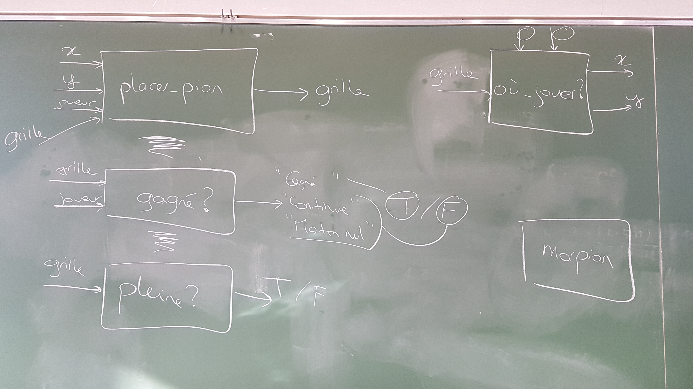
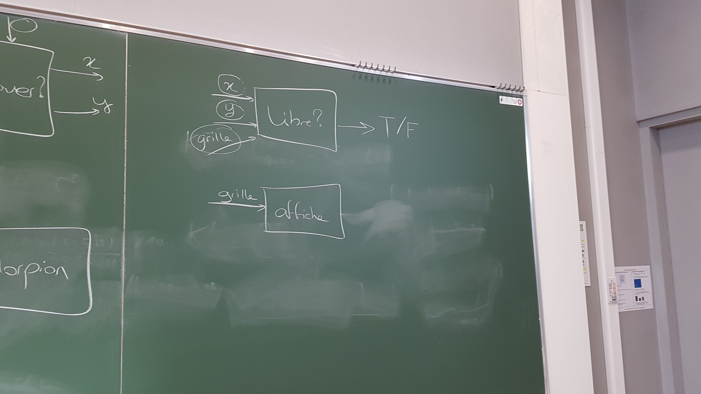

---
title : Analyse et décomposition de problèmes
subtitle: Planche de TD pour un cours dispensé à l'université de Rennes 2
language: fr
author: Aurélie Lemaitre, Agnès Maunoury, Romain Tavenard
rights: Creative Commons CC BY-NC-SA
---

# Philosophie du sujet

Lorsqu'on souhaite résoudre un problème, il est souvent nécessaire de le décomposer en sous-fonctions. En TD d'informatique, les sujets que vous recevez sont souvent déjà décomposés par les enseignants : ils réfléchissent pour vous aux structures de données, à la signature des fonctions à utiliser, ainsi qu'à l'appel de la fonction principale pour résoudre un problème global.

Lors de cette séance, vous allez devoir rédiger un sujet de TD, afin de vous guider pour coder les fonctions pour réaliser un jeu : le Tic Tac Toe.
Pour rédiger ce sujet de TD, vous indiquerez explicitement :

* les structures de données utiles pour représenter les éléments principaux (ex : xxx sera représenté sous la forme d'une liste, d'une matrice...)
* les noms, les signatures et le rôle des fonctions (ex : coder la fonction xxx qui prend en entrée zzz, qui calcule/affiche yyy et qui renvoie www)
* l'appel nécessaire pour lancer le jeu (ex : coder la fonction principale yyy qui sera appelée pour lancer le jeu)

Dans un second temps, vous implémenterez le sujet de TD proposé.

# Tic Tac Toe

Le Tic Tac Toe est un jeu qui se joue à deux joueurs, identifiés par les symboles "X" ou "O". Les joueurs jouent chacun leur tour, en plaçant leur symbole dans une grille de 3 cases par 3. Le gagnant est le premier à réaliser un alignement de trois symboles, en vertical, en horizontal ou en diagonale. Si les joueurs remplissent toute la grille sans réussir à réaliser un alignement, alors il y a match nul.

On souhaite réaliser une implémentation qui respecte les contraintes suivantes :

* les deux joueurs sont joués par des humains,
* on jouera dans une grille de 9 cases (3*3),
* on souhaite obtenir les traces d'exécution suivantes :

	* Trace 1 (victoire d'un des joueurs) :
```python
# C'est au tour du joueur  X
# Dans quelle ligne souhaitez-vous jouer ? (0, 1 ou 2) 0
# Dans quelle colonne souhaitez-vous jouer ? (0, 1 ou 2) 1
# - X -
# - - -
# - - -
#
# C'est au tour du joueur  O
# Dans quelle ligne souhaitez-vous jouer ? (0, 1 ou 2) 0
# Dans quelle colonne souhaitez-vous jouer ? (0, 1 ou 2) 2
# - X O
# - - -
# - - -
#
# C'est au tour du joueur  X
# Dans quelle ligne souhaitez-vous jouer ? (0, 1 ou 2) 1
# Dans quelle colonne souhaitez-vous jouer ? (0, 1 ou 2) 1
# - X O
# - X -
# - - -
#
# C'est au tour du joueur  O
# Dans quelle ligne souhaitez-vous jouer ? (0, 1 ou 2) 1
# Dans quelle colonne souhaitez-vous jouer ? (0, 1 ou 2) 1
# Case non disponible (déjà remplie)
# C'est au tour du joueur  O
# Dans quelle ligne souhaitez-vous jouer ? (0, 1 ou 2) 1
# Dans quelle colonne souhaitez-vous jouer ? (0, 1 ou 2) 2
# - X O
# - X O
# - - -
#
# C'est au tour du joueur  X
# Dans quelle ligne souhaitez-vous jouer ? (0, 1 ou 2) 2
# Dans quelle colonne souhaitez-vous jouer ? (0, 1 ou 2) 1
# - X O
# - X O
# - X -
#
# Joueur X a gagné
```

	* Trace 2 (match nul) :
```python
# C'est au tour du joueur  X
# Dans quelle ligne souhaitez-vous jouer ? (0, 1 ou 2) 0
# Dans quelle colonne souhaitez-vous jouer ? (0, 1 ou 2) 1
# - X -
# - - -
# - - -
#
# C'est au tour du joueur  O
# Dans quelle ligne souhaitez-vous jouer ? (0, 1 ou 2) 1
# Dans quelle colonne souhaitez-vous jouer ? (0, 1 ou 2) 2
# - X -
# - - O
# - - -
#
# C'est au tour du joueur  X
# Dans quelle ligne souhaitez-vous jouer ? (0, 1 ou 2) 2
# Dans quelle colonne souhaitez-vous jouer ? (0, 1 ou 2) 1
# - X -
# - - O
# - X -
#
# C'est au tour du joueur  O
# Dans quelle ligne souhaitez-vous jouer ? (0, 1 ou 2) 1
# Dans quelle colonne souhaitez-vous jouer ? (0, 1 ou 2) 1
# - X -
# - O O
# - X -
#
# C'est au tour du joueur  X
# Dans quelle ligne souhaitez-vous jouer ? (0, 1 ou 2) 1
# Dans quelle colonne souhaitez-vous jouer ? (0, 1 ou 2) 0
# - X -
# X O O
# - X -
#
# C'est au tour du joueur  O
# Dans quelle ligne souhaitez-vous jouer ? (0, 1 ou 2) 0
# Dans quelle colonne souhaitez-vous jouer ? (0, 1 ou 2) 0
# O X -
# X O O
# - X -
#
# C'est au tour du joueur  X
# Dans quelle ligne souhaitez-vous jouer ? (0, 1 ou 2) 2
# Dans quelle colonne souhaitez-vous jouer ? (0, 1 ou 2) 2
# O X -
# X O O
# - X X
#
# C'est au tour du joueur  O
# Dans quelle ligne souhaitez-vous jouer ? (0, 1 ou 2) 2
# Dans quelle colonne souhaitez-vous jouer ? (0, 1 ou 2) 0
# O X -
# X O O
# O X X
#
# C'est au tour du joueur  X
# Dans quelle ligne souhaitez-vous jouer ? (0, 1 ou 2) 0
# Dans quelle colonne souhaitez-vous jouer ? (0, 1 ou 2) 2
# O X X
# X O O
# O X X
#
# Match nul
```

# Resultat des premières investigations (après le CM)

Ce sujet a déjà commencé à être étudié en CM. Vous êtes arrivés, collectivement,
aux choix suivants :

1. La grille sera représentée par une liste de 3 listes de chaînes de caractères
représentant les lignes de cette grille, par exemple :
```python
grille = [["X", "-", "O"],
          ["-", "-", "X"],
          ["-", "-", "-"]]
```

2. Les briques suivantes ont été proposées :

&nbsp;

&nbsp;

Partant de ce début de mise en forme, rédigez un énoncé de TD dans lequel
vous indiquerez explicitement :

* les noms, les signatures et le rôle des fonctions (ex : coder la fonction xxx
    qui prend en entrée zzz, qui calcule/affiche yyy et qui renvoie www)
* les tests proposés pour chacune des fonctions (avec les données spécifiées)

# Proposition d'énoncé

1. Écrivez une fonction `affiche` qui prenne en entrée une grille et l'affiche.
Vous testerez cette fonction à l'aide du code suivant :
```python
grille = [["X", "-", "O"],
          ["-", "-", "X"],
          ["-", "-", "-"]]
affiche(grille)
```

2. Écrivez une fonction `pleine` qui prenne en entrée une grille et retourne `True` si elle est pleine et `False` sinon.
Vous testerez cette fonction à l'aide du code suivant :
```python
print(pleine(grille))
grille2 = [["X", "O", "X"],
           ["O", "X", "O"],
           ["X", "O", "O"]]
print(pleine(grille2))
```

3. Écrivez une fonction `libre` qui prenne en entrée une grille et une position et retourne `True` si la case située à la position spécifiée est libre dans la grille et `False` sinon.
Vous testerez cette fonction à l'aide du code suivant :
```python
print(libre(grille, 0, 0))
print(libre(grille, 1, 0))
```

4. Écrivez une fonction `ou_jouer` qui prenne en entrée une grille, demande à l'utilisateur les coordonnées où il veut jouer (jusqu'à ce que celles-ci soient valides) et retourne ces coordonnées.
Vous testerez cette fonction à l'aide du code suivant :
```python
print(ou_jouer(grille))
# En tant qu'utilisateur, on entrera d'abord les valeurs 1 0 puis 0 0
```

5. Écrivez une fonction `placer_pion` qui prenne en entrée des coordonnées, un joueur et une grille et retourne la grille mise à jour.
Vous testerez cette fonction à l'aide du code suivant :
```python
affiche(placer_pion(0, 0, "X", grille))
```

6. Écrivez une fonction `gagne` qui prenne en entrée une grille et un joueur et retourne `True` si le joueur a gagné et `False` sinon.
Vous testerez cette fonction à l'aide du code suivant :
```python
print(gagne(grille2, "X"))
print(gagne(grille2, "O"))
```

7. Écrivez une fonction `morpion` qui déroule le jeu de morpion.
Vous testerez cette fonction à l'aide du code suivant :
```python
morpion()
```
