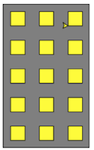
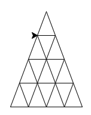

Le but de cette séance est de continuer à vous habituer à la programmation en
Python et notamment aux notions de :

* structures conditionnelles ;
* boucles ;
* fonction.

Pour cela, nous manipulerons le module `turtle`{.python} dont le principe est
de suivre dans une fenêtre l'évolution d'une tortue (symbolisée par une flèche)
qui suivra vos instructions à la lettre.

# Organisation de votre code

Pour ce TD, vous créerez un nouveau fichier `td2.py` dans le répertoire que
vous avez créé à la première séance.

Dans ce nouveau nouveau fichier, votre code sera organisé de la manière
suivante :

```python
# Section 1 : les imports
import turtle

# Section 2 : les définitions de fonctions
[...]

def immeuble(n_etages, n_fenetres):
    [...]

[...]

# Section 3 : les tests (un ou plusieurs par fonction codée)
[...]
immeuble(n_etages=3, n_fenetres=2)
[...]
```

Notamment, vous définirez vos fonctions en début de fichier et les appels
seront listés en fin de fichier. De cette manière, vous pourrez, d'une question
à l'autre, réutiliser les fonctions déjà codées au besoin.
Si vous souhaitez, à un certain moment, ne plus ré-exécuter vos tests de début
de TD, il suffira de commenter les appels de fonction correspondants
(mais pas les fonctions elles-mêmes !).

# Présentation du module `turtle`

Lors de cette séance de TD, vous serez amenés à faire appel aux fonctions de
base du module `turtle`{.python} suivantes :

* `turtle.forward(dist)`{.python} : faire avancer la tortue de `dist`{.python}
unités ;
* `turtle.left(alpha)`{.python} : faire tourner la tortue sur la gauche d'un
angle de `alpha`{.python} degrés ;
* `turtle.right(alpha)`{.python} : faire tourner la tortue sur la droite d'un
angle de `alpha`{.python} degrés ;
* `turtle.up()`{.python} : faire léviter la tortue (sa trace ne s'écrira donc
plus à l'écran) ;
* `turtle.down()`{.python} : stopper la lévitation de la tortue ;
* `turtle.goto(x, y)`{.python} : faire se déplacer la tortue jusqu'à la
position `(x, y)`{.python}.

# Lecture d'un programme

1. Sans l'exécuter pour le moment, tentez de comprendre ce que fait le code
suivant et de deviner ce qu'il affichera à l'écran :

```python
import turtle

for i in range(100):
    turtle.forward(10 + i)
    turtle.left(90)

turtle.exitonclick()  # Attend un clic avant de fermer la fenetre
```

2. Vérifiez votre prédiction en exécutant ce code.

# L'étoile à 5 branches

3. Dessinez à l'écran une étoile à 5 branches similaire à celle-ci :


# Sur papier

4. Quels sont les prototypes (liste d'arguments et leur type, liste de valeurs
de retours et leur type) des fonctions `rectangle`, `carre` et `immeuble`
présentées dans la section [L'immeuble] ci-dessous ?

# L'immeuble

Pour cet exercice, votre code final devra ressembler à :

```python
import turtle

# [...]

n_etages = 5
n_fenetres = 3
immeuble(n_etages, n_fenetres)
turtle.exitonclick()  # Attend un clic avant de fermer la fenetre
```

L'exécution de ce code devra faire dérouler à l'écran une animation se
terminant sur le dessin suivant :



Pour cela, vous définirez 4 fonctions (à l'emplacement des points de suspension
dans l'extrait de code ci-dessus) :

* `position`{.python} permettra de placer la tortue à la position spécifiée,
sans que celle-ci ne laisse de trace à l'écran ;
* `rectangle`{.python} permettra de dessiner un rectangle à l'écran ;
* `carre`{.python} permettra de dessiner un carré à l'écran ;
* `immeuble`{.python} permettra de dessiner un immeuble tel que celui
représenté ci-dessus à l'écran.

## La fonction position
5. Écrivez une fonction `position`{.python} qui permette de placer la tortue à
la position spécifiée, sans que celle-ci ne laisse de trace à l'écran

## La fonction rectangle
6. Écrivez une fonction `rectangle`{.python} qui permette de tracer à l'écran
un rectangle de taille et de position spécifiées lors de l'appel de la fonction.

## La fonction carre
7. Écrivez une fonction `carre`{.python} qui permette de tracer à l'écran un
carré de taille et de position spécifiées lors de l'appel de la fonction.
Est-il nécessaire de réécrire la fonction dans son ensemble (avec les appels
    successifs aux fonctions du module `turtle`{.python}) ou est-ce possible de
    s'en sortir en une ligne de code ?

## La fonction immeuble
8. Écrivez une fonction `immeuble`{.python} qui permette de tracer un immeuble
à l'écran, connaissant son nombre d'étages et le nombre de fenêtres par étage.
N'hésitez pas à faire un schéma de l'immeuble sur papier pour vous rendre
compte des dimensions à utiliser.
Vous définirez au sein de la fonction `immeuble`{.python} les grandeurs
caractéristiques nécessaires (taille des fenêtres, espace inter-fenêtres,
    _etc._).

## Un peu de _tuning_
9. Ajoutez aux fonctions nécessaires un paramètre facultatif qui permette de
spécifier la couleur de remplissage des formes géométriques tracées.
Utilisez ce paramètre facultatif pour demander de tracer l'immeuble en gris
(`"grey"`{.haskell}) et les fenêtres en jaune (`"yellow"`{.haskell}).
Pour cela, vous aurez besoin des fonctions `turtle.fillcolor(couleur)`{.python},
`turtle.begin_fill()`{.python} et `turtle.end_fill()`{.python} qui s'utilisent
comme suit :

```python
turtle.fillcolor(couleur)
turtle.begin_fill()
# Ici, tracer le polygone
turtle.end_fill()
```

# Devoir à rendre : le château de cartes

**Cet exercice est à rendre sur CURSUS avant la séance de TD de la semaine
prochaine.
Vous pouvez le rendre par binôme ou trinôme, mais dans ce cas, le nom de tous 
les membres du groupe doit être inscrit dans le fichier python en commentaire 
avant le `import turtle`.**

Dans cet exercice, vous allez tenter de dessiner à l'écran un château de cartes
similaire à celui-ci :



Pour cela, vous devrez tout d'abord être capable de tracer un triangle
(dont la base est horizontale) à une position donnée.

10. Écrivez une fonction qui prenne en entrée une position (sous la forme de
    deux entiers `x`{.python} et `y`{.python}), une longueur de la base `base`{.python}
    et une hauteur `hauteur`{.python} et qui trace à l'écran un triangle dont le
    point en bas à gauche a pour coordonnées `(x, y)`{.python} et dont la base et la 
    hauteur ont les dimensions demandées.

11. Écrivez une fonction qui prenne en entrée un nombre `n`{.python} 
    et trace à l'écran un château de cartes dont la base est composée de
    `n`{.python} triangles.
    L'image fournie plus haut devra typiquement
    être générée par un appel à votre fonction avec pour argument
    `n=4`{.python}.
    La hauteur et la largeur du château de carte seront définies de manière arbitraire.
