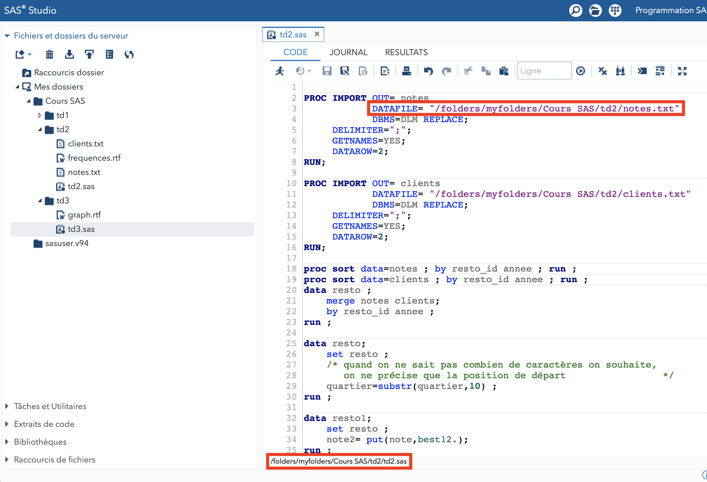

Ce document décrit les étapes à suivre pour créer un dossier et un programme SAS dans l'interface SAS Studio (utilisée par SAS OnDemand et SAS University).

Liens pour accéder à ces outils :

* [SAS University](https://www.sas.com/en_us/software/university-edition/download-software.html) : exécution de code SAS par votre machine, contrôlé depuis un navigateur
* [SAS OnDemand](https://welcome.oda.sas.com/login) : même interface que SAS University sauf que le code sera exécuté sur un serveur SAS distant (pas besoin donc d'installer un quelconque logiciel sur votre machine)

# Etape 1 : créer un répertoire de travail

Dans l'interface de SAS Studio, dans le panneau de gauche, lorsque vous êtes dans l'onglet "Fichiers et dossiers du serveur", vous pouvez demander la création d'un nouveau dossier :

&nbsp;

Ce dossier contiendra votre programme SAS ainsi que vos fichiers de données à importer, voire vos exports depuis SAS.

# Étape 2 : créer un programme SAS dans ce dossier

Une fois ce dossier créé, vous pouvez cliquer droit sur son nom et choisir d'y ajouter un nouveau programme SAS :

&nbsp;

Cela va ouvrir un nouveau fichier dans la fenêtre de programme que vous pourrez sauvegarder :

&nbsp;

# Étape 3 : charger un fichier de données dans votre répertoire

Les fichiers de données (`.csv`, `.xls`, `.txt`, etc.) doivent être chargés dans le répertoire de travail pour pouvoir être lus par votre programme SAS :

&nbsp;

Attention, le chemin vers ce fichier est assez peu prévisible car le début de ce chemin est généré par SAS OnDemand (ou SAS University). Pour connaître ce chemin (et l'utiliser dans une `PROC IMPORT` ou toute autre commande qui utilise un chemin), on peut le trouver en bas du panneau d'éditeur :

&nbsp;

# Étape 4 : accéder aux bibliothèques

Pour accéder aux bibliothèques comme vous en avez eu l'habitude en TD, il faut sélectionner l'onglet correspondant dans le panneau de gauche :

&nbsp;

et l'on obtient :

&nbsp;

# Étape 5 : récupérer votre programme SAS

Enfin, une fois votre programme SAS finalisé et sauvegardé, vous pouvez le télécharger sur votre ordinateur (par exemple en vue de le déposer sur le dépôt CURSUS) :

&nbsp;
